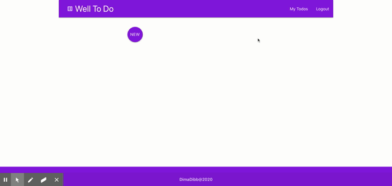

# Well To Do

App use to organize your tasks and never miss a deadline.

When you finish your tasks you can mark them as done. You can then deleted the task if you want.

WellToDo is built using React as frontend technology, Mongodb, express and NodeJS for the backend.

